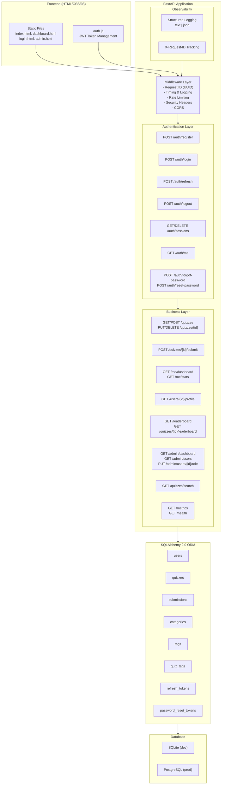
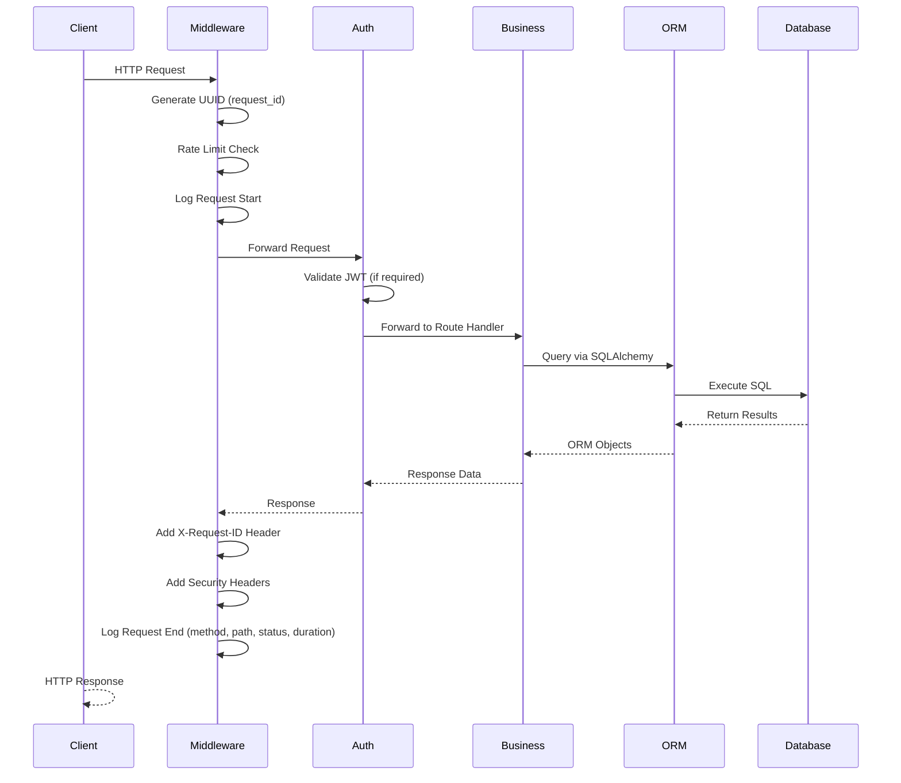
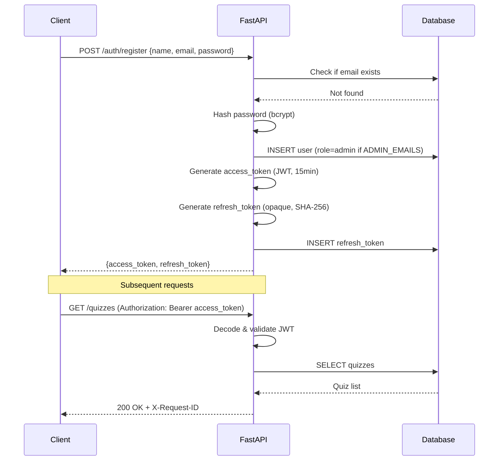

# Architecture Diagram

```mermaid
graph TB
    subgraph Frontend["Frontend (HTML/CSS/JS)"]
        UI["Static Files<br/>index.html, dashboard.html<br/>login.html, admin.html"]
        AUTH["auth.js<br/>JWT Token Management"]
    end

    subgraph API["FastAPI Application"]
        MID["Middleware Layer<br/>- Request ID (UUID)<br/>- Timing & Logging<br/>- Rate Limiting<br/>- Security Headers<br/>- CORS"]

        subgraph Auth["Authentication Layer"]
            REG["POST /auth/register"]
            LOGIN["POST /auth/login"]
            REFRESH["POST /auth/refresh"]
            LOGOUT["POST /auth/logout"]
            SESSIONS["GET/DELETE /auth/sessions"]
            ME["GET /auth/me"]
            PWRESET["POST /auth/forgot-password<br/>POST /auth/reset-password"]
        end

        subgraph Business["Business Layer"]
            QUIZZES["GET/POST /quizzes<br/>PUT/DELETE /quizzes/{id}"]
            SUBMIT["POST /quizzes/{id}/submit"]
            DASHBOARD["GET /me/dashboard<br/>GET /me/stats"]
            PROFILE["GET /users/{id}/profile"]
            LEADERBOARD["GET /leaderboard<br/>GET /quizzes/{id}/leaderboard"]
            ADMIN["GET /admin/dashboard<br/>GET /admin/users<br/>PUT /admin/users/{id}/role"]
            SEARCH["GET /quizzes/search"]
            METRICS["GET /metrics<br/>GET /health"]
        end

        subgraph Obs["Observability"]
            LOGS["Structured Logging<br/>text | json"]
            REQID["X-Request-ID Tracking"]
        end
    end

    subgraph ORM["SQLAlchemy 2.0 ORM"]
        USERS["users"]
        QUIZ["quizzes"]
        SUBM["submissions"]
        CAT["categories"]
        TAGS["tags"]
        QT["quiz_tags"]
        RT["refresh_tokens"]
        PRT["password_reset_tokens"]
    end

    subgraph DB["Database"]
        SQLITE["SQLite (dev)"]
        PG["PostgreSQL (prod)"]
    end

    UI --> MID
    AUTH --> MID
    MID --> Auth
    Auth --> Business
    Business --> ORM
    Obs --> MID
    ORM --> DB
```

## Fluxo de Requisição

```mermaid
sequenceDiagram
    participant C as Client
    participant M as Middleware
    participant A as Auth
    participant B as Business
    participant O as ORM
    participant D as Database

    C->>M: HTTP Request
    M->>M: Generate UUID (request_id)
    M->>M: Rate Limit Check
    M->>M: Log Request Start
    M->>A: Forward Request
    A->>A: Validate JWT (if required)
    A->>B: Forward to Route Handler
    B->>O: Query via SQLAlchemy
    O->>D: Execute SQL
    D-->>O: Return Results
    O-->>B: ORM Objects
    B-->>A: Response Data
    A-->>M: Response
    M->>M: Add X-Request-ID Header
    M->>M: Add Security Headers
    M->>M: Log Request End (method, path, status, duration)
    C-->>C: HTTP Response
```

## Fluxo de Autenticação

```mermaid
sequenceDiagram
    participant C as Client
    participant API as FastAPI
    participant DB as Database

    C->>API: POST /auth/register {name, email, password}
    API->>DB: Check if email exists
    DB-->>API: Not found
    API->>API: Hash password (bcrypt)
    API->>DB: INSERT user (role=admin if ADMIN_EMAILS)
    API->>API: Generate access_token (JWT, 15min)
    API->>API: Generate refresh_token (opaque, SHA-256)
    API->>DB: INSERT refresh_token
    API-->>C: {access_token, refresh_token}

    Note over C,API: Subsequent requests

    C->>API: GET /quizzes (Authorization: Bearer access_token)
    API->>API: Decode & validate JWT
    API->>DB: SELECT quizzes
    DB-->>API: Quiz list
    API-->>C: 200 OK + X-Request-ID
```
